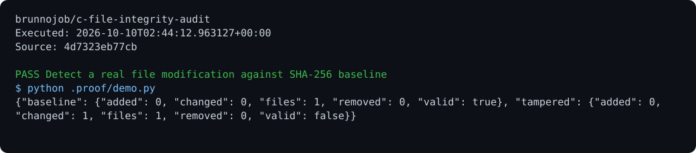

# File Integrity Audit

A recursive SHA-256 file inventory with size comparison and detection of additions, changes, and removals.

## Run

Requirements: C17 and OpenSSL.

```sh
make
build/integrity snapshot ./arquivos > ./baseline.txt
build/integrity verify ./arquivos ./baseline.txt > result.json
```

## Behavior

Keep the manifest outside the audited directory. Symbolic links and special files are rejected. Exit codes: 0 for an exact match, 1 for differences, and 2 for an error. Keep the baseline manifest under your control.

## Optional report archive

Use the [native C operations archive client](https://github.com/brunnojob/vercel-home-telemetry-api/tree/main/clients/c) to queue `result.json` under project `c-file-integrity-audit`. The client uses `BRUNNODEV_ACCESS_TOKEN` and retains unacknowledged reports locally.

## License

Original source and documentation are MIT licensed; see [LICENSE](LICENSE). Third-party dependencies and media retain their respective terms. Maintained by [Brunno Dev](https://brunnodev.store).

## Implementation update

Manifest parsing rejects absent, negative or unrepresentable file sizes and trailing data after encoded paths. Invalid manifests return an error rather than producing a misleading comparison.

Contribution trailer: `Co-authored-by: nyctophile <329826984+ineedfoundmyway@users.noreply.github.com>`.

## Execution proof

[](https://github.com/brunnojob/c-file-integrity-audit/actions/workflows/proof.yml)



[Verified run](https://github.com/brunnojob/c-file-integrity-audit/actions/runs/38017552853) · [Execution report](docs/proof/evidence.json)

Run `python .proof/record.py` after installing the prerequisites above. The scenarios execute repository code and verify exit codes and expected output. CI publishes `execution-proof` with the transcript, input fingerprints and source commit. The downloadable report identifies the exact tested version; the workflow badge tracks the latest run.
